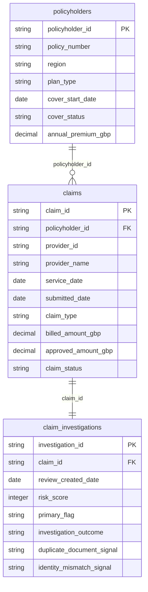

# health_insurance_claims

## Synthetic Health Claims Demo

This repository contains a deterministic, synthetic dataset for demonstrating historical private health claims analysis and fraud-investigation workflows in Power BI. It is not real customer, provider, or claims data, and it must not be used for real underwriting, claims decisions, or medical analysis.

### Tables

- `policyholders.csv`: 300 synthetic policyholders and policy attributes.
- `claims.csv`: 800 synthetic claims from 2022 through 2025. Join to policyholders using `policyholder_id`.
- `claim_investigations.csv`: one investigation record per claim. Join to claims using `claim_id`.

### Power BI semantic model

The tables form a simple star schema. In Power BI, create these active relationships with single-direction filtering:

| From | To | Cardinality | Join key |
|---|---|---|---|
| `policyholders` | `claims` | One-to-many | `policyholder_id` |
| `claims` | `claim_investigations` | One-to-one currently | `claim_id` |

Use `policyholders` for filtering and grouping, `claims` for financial and historical measures, and `claim_investigations` for fraud-risk analysis. The investigation table currently has one row per claim; a future production model could use one-to-many if a claim can have multiple review events.

The planted review patterns include high-value claims, repeated provider/member activity, duplicate-document signals, identity-mismatch signals, and simulated investigation outcomes. These are intentionally explainable patterns for dashboard demonstrations, not evidence about real people or providers.

### Regenerate

Run `python generate_dataset.py` to recreate all three CSVs with the same values. The generator uses a fixed seed so relationships and results remain stable between runs.

### Research basis

The synthetic field choices are informed by the general UK insurance and healthcare context described by the Association of British Insurers' fraud guidance and NHS hospital guidance:

- https://www.abi.org.uk/products-and-issues/topics-and-issues/fraud/
- https://www.nhs.uk/nhs-services/hospitals/going-into-hospital/