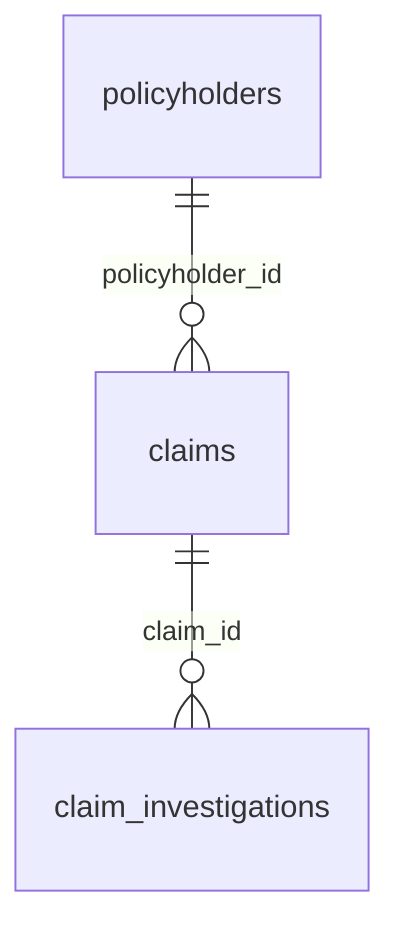

# Health Insurance Claims Power BI Copilot Hackathon

This repository contains a deterministic, synthetic private health insurance dataset for a Microsoft Fabric and Power BI Copilot hackathon.

Participants will:

1. Create a lakehouse in Microsoft Fabric.
2. Choose automated notebook ingestion or manual CSV upload.
3. Load the CSV data into lakehouse Delta tables.
4. Build a semantic model with the supplied relationships and measures.
5. Use Power BI Copilot to create report pages and explore the data.

## Start here

Follow the [Power BI Copilot hackathon instruction manual](./hackathon-guide/README.md). It includes:

- Fabric and Copilot prerequisites
- Automated notebook ingestion and manual CSV upload instructions
- Table and semantic-model configuration
- Recommended DAX measures
- Three report-page exercises with example Copilot prompts
- Ten prompts for report consumers
- Validation checks and troubleshooting guidance

The source files are in the [`data`](./data) folder:

- [`policyholders.csv`](./data/policyholders.csv): 300 synthetic policyholders and policy attributes
- [`claims.csv`](./data/claims.csv): 800 synthetic claims from 2022 through 2025
- [`claim_investigations.csv`](./data/claim_investigations.csv): 938 investigation review events

For the automated option, import [`Notebook CSV to Delta.ipynb`](./Notebook%20CSV%20to%20Delta.ipynb) into the Fabric workspace. After you attach the lakehouse and set it as the notebook's default lakehouse, running all cells downloads the three CSV files from this repository into the lakehouse **Files** area and creates managed Delta tables. The instruction manual also retains the manual download, upload, and **Load to tables** option.

## Data model

Create these active, single-direction relationships:

| One side | Many side | Key |
|---|---|---|
| `policyholders` | `claims` | `policyholder_id` |
| `claims` | `claim_investigations` | `claim_id` |

Use `policyholders` for customer and policy attributes, `claims` for financial and historical analysis, and `claim_investigations` for review-stage and risk analysis.

## Important data notice

All records are synthetic. They do not represent real customers, providers, claims, diagnoses, or investigations. Use the data only for learning and demonstrations, not for underwriting, claims decisions, fraud allegations, medical analysis, or other real-world decisions.

The planted patterns are deliberately explainable and include high-value claims, repeated provider/member activity, duplicate-document signals, identity-mismatch signals, and simulated investigation outcomes.

## Research basis

The synthetic field choices are informed by the general UK insurance and healthcare context described by:

- [Association of British Insurers fraud guidance](https://www.abi.org.uk/products-and-issues/topics-and-issues/fraud/)
- [NHS hospital guidance](https://www.nhs.uk/nhs-services/hospitals/going-into-hospital/)
