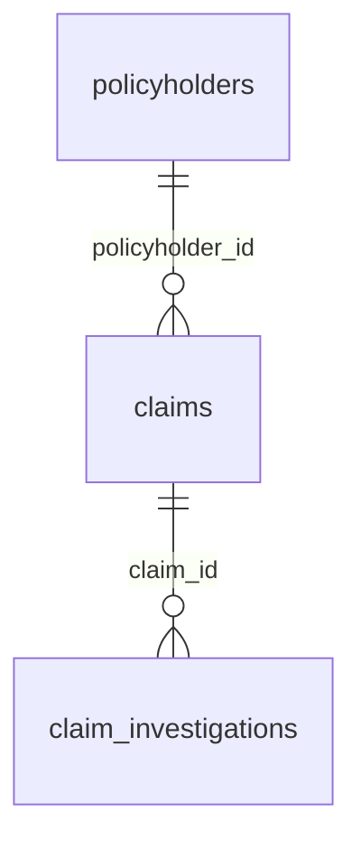

# Power BI Copilot Hackathon Instruction Manual

This guide takes you from three CSV files to a working Power BI semantic model, Copilot-generated report pages, and Copilot-assisted data exploration.

The hackathon is intentionally open-ended: you are welcome to use the data and Copilot in whatever way interests you. The steps, measures, report pages, and prompts below are examples to help you get started and show what is possible, not a fixed set of tasks that you must reproduce exactly. Adapt them, combine them, or replace them with your own ideas.

> All data is synthetic. Copilot output can be incomplete or incorrect, so verify every visual, measure, and narrative against the semantic model.

## Explore different personas

Try approaching the data from more than one perspective:

- **Report developer:** Prepare the semantic model, ask Copilot to generate or explain DAX, create report pages and visuals, refine layouts, and improve the model so Copilot can understand it more accurately.
- **Report consumer:** Explore an existing report using natural-language questions, request summaries and comparisons, ask for supporting evidence, challenge an answer, and follow interesting findings with more specific questions.

Switch between the personas during the session. For example, ask a question as a consumer, notice that the report cannot answer it clearly, then return to the developer role to add a measure or visual. Experiment with your wording, compare Copilot responses, and keep asking follow-up questions. The aim is to discover both what Copilot can do and where human judgement and model design are still important.

## One possible outcome

If you follow the examples from end to end, you will have:

- A Fabric lakehouse containing three tables
- A Power BI semantic model with two active relationships
- A set of reusable business measures
- Three report pages covering claims, providers, and investigations
- A collection of prompts that report consumers can use to understand the data

Allow approximately 60–90 minutes for this path, or spend the time experimenting with the areas that are most useful to you.

## 1. Prerequisites

Before starting, confirm that:

- You can sign in to Microsoft Fabric.
- You have a workspace assigned to a supported paid Fabric or Power BI Premium capacity.
- Copilot is enabled for your tenant and capacity by your administrator.
- You can create lakehouses, semantic models, and Power BI reports in the workspace.
- Your browser allows downloads from GitHub.

Copilot availability depends on your tenant, region, capacity, licensing, and administrator settings. If the Copilot button is missing, ask your event facilitator before continuing.

## 2. Download the CSV files

The files are located in the repository's [`data`](../data) folder:

- [`policyholders.csv`](../data/policyholders.csv)
- [`claims.csv`](../data/claims.csv)
- [`claim_investigations.csv`](../data/claim_investigations.csv)

### Option A: Download the repository

1. On the repository page, select **Code**.
2. Select **Download ZIP**.
3. Extract the ZIP file.
4. Open the `data` folder and confirm that all three CSV files are present.

### Option B: Download files individually

1. Open a CSV file from the list above.
2. Select **Download raw file**.
3. Repeat for all three files.

Keep the filenames unchanged. They will become the table names used throughout this guide.

## 3. Create a Fabric lakehouse

Fabric labels can change slightly over time, but the workflow remains the same.

1. Open [Microsoft Fabric](https://app.fabric.microsoft.com/).
2. Open the workspace supplied by your event facilitator.
3. Select **New item**.
4. Search for and select **Lakehouse**.
5. Name it `HealthInsuranceClaims`.
6. Select **Create**.
7. Wait for the Lakehouse explorer to open.

## 4. Upload the CSV files as lakehouse files

1. In the Lakehouse explorer, locate the **Files** section.
2. Select the ellipsis (`...`) beside **Files**, then select **Upload** > **Upload files**.
3. Select all three CSV files.
4. Start the upload.
5. Confirm that the following files appear under **Files**:
   - `policyholders.csv`
   - `claims.csv`
   - `claim_investigations.csv`

Uploading a file does not create a queryable table. Complete the next section for each file.

## 5. Load the files into tables

For each CSV file:

1. Select the ellipsis (`...`) beside the file.
2. Select **Load to tables** > **New table**.
3. Use the filename without `.csv` as the table name.
4. Confirm that the first row is treated as the header.
5. Accept comma as the delimiter and review the preview.
6. Select **Load**.

Create exactly these tables:

| CSV file | Table name | Expected rows | Primary identifier |
|---|---|---:|---|
| `policyholders.csv` | `policyholders` | 300 | `policyholder_id` |
| `claims.csv` | `claims` | 800 | `claim_id` |
| `claim_investigations.csv` | `claim_investigations` | 938 | `investigation_id` |

### Check data types

Review the inferred types after loading. At minimum, use:

| Columns | Recommended type |
|---|---|
| All `_date` columns and `date_of_birth` | Date |
| `annual_premium_gbp`, `billed_amount_gbp`, `approved_amount_gbp` | Decimal number |
| `risk_score`, `review_sequence`, `provider_claims_last_90_days`, `member_claims_last_90_days` | Whole number |
| Identifier, category, name, code, Yes/No, and notes columns | Text |

Do not aggregate identifiers such as `claim_id`, `policyholder_id`, or `provider_id`.

## 6. Create the semantic model

1. From the lakehouse, start the **New semantic model** action. Depending on the current Fabric experience, this may appear on the lakehouse ribbon or under **New Power BI semantic model**.
2. Name the model `Health Insurance Claims`.
3. Select all three lakehouse tables.
4. Select **Confirm** or **Create**.
5. Open the semantic model in the web model editor.

### Establish the relationships

In model view, create or verify these relationships:

| From (one) | To (many) | Key | Cardinality | Cross-filter direction | Active |
|---|---|---|---|---|---|
| `policyholders` | `claims` | `policyholder_id` | One-to-many (`1:*`) | Single | Yes |
| `claims` | `claim_investigations` | `claim_id` | One-to-many (`1:*`) | Single | Yes |

The model should look like this:



If Fabric detects a many-to-many relationship, first check that the correct columns are selected. The one-side identifiers are unique in the supplied data.

### Improve Copilot's understanding

In the model editor:

1. Set identifier columns to **Do not summarize**.
2. Format GBP fields as currency with two decimal places.
3. Format date fields as dates rather than date/time.
4. Give measures clear business names.
5. If the model editor supports descriptions, add short descriptions to tables and measures.
6. Hide technical columns from report view only when they are not useful to participants.

Clear names, types, formats, and relationships give Copilot better model context.

## 7. Add useful measures

The measures below are a useful starting point, not a required list. Try asking Copilot to generate the DAX from a plain-English business question before looking at the reference definition. You can also change a measure, ask Copilot to explain unfamiliar DAX, or invent measures for questions you want the report to answer.

Create any measures you want to explore. If you use the examples below, add the first group to the `claims` table. Compare Copilot-generated DAX with the reference definition before saving it.

```DAX
Total Claims =
DISTINCTCOUNT(claims[claim_id])
```

```DAX
Total Billed Amount =
SUM(claims[billed_amount_gbp])
```

```DAX
Total Approved Amount =
SUM(claims[approved_amount_gbp])
```

```DAX
Approval Rate =
DIVIDE([Total Approved Amount], [Total Billed Amount])
```

```DAX
Average Approved Claim =
DIVIDE([Total Approved Amount], [Total Claims])
```

```DAX
Declined Claims =
CALCULATE(
    [Total Claims],
    claims[claim_status] = "Declined"
)
```

```DAX
Average Submission Lag Days =
AVERAGEX(
    claims,
    DATEDIFF(claims[service_date], claims[submitted_date], DAY)
)
```

Create the following measures in the `claim_investigations` table:

```DAX
Average Risk Score =
AVERAGE(claim_investigations[risk_score])
```

```DAX
High Risk Claims =
CALCULATE(
    DISTINCTCOUNT(claim_investigations[claim_id]),
    claim_investigations[risk_score] >= 60
)
```

```DAX
SIU Referred Claims =
CALCULATE(
    DISTINCTCOUNT(claim_investigations[claim_id]),
    claim_investigations[investigation_outcome] = "Referred to SIU"
)
```

Format `Approval Rate` as a percentage, the amount measures as GBP currency, and the other measures as whole or decimal numbers as appropriate.

### Measure-building Copilot prompts

Try asking Copilot:

- `Write a measure named Total Approved Amount that sums approved_amount_gbp. Format it as GBP currency.`
- `Create a measure for approved amount divided by billed amount. It must safely handle division by zero.`
- `Create a distinct count of claims whose investigation risk score is at least 60.`
- `Explain this DAX measure in plain English and identify any filter-context issues: [paste measure].`
- `Suggest three additional measures for monitoring claim cost, processing time, and investigation risk using only fields in this model. Do not create calculated columns.`

Always review generated DAX for the correct table, column, aggregation, and filter behavior.

### Checkpoint

With no report filters applied, the supplied data should produce approximately:

| Check | Expected result |
|---|---:|
| Total Claims | 800 |
| Total Billed Amount | £1,631,931.97 |
| Total Approved Amount | £1,266,715.03 |
| Approval Rate | 77.62% |
| Average Risk Score | 23.89 |
| SIU Referred Claims | 42 |

Small display differences caused by rounding are acceptable. Larger differences usually indicate an incorrect aggregation, relationship, or data type.

## 8. Build report pages with Power BI Copilot

The three pages below demonstrate one possible report. You are encouraged to change the audience, business question, visuals, layout, and style, or create completely different pages. Try prompting for the same outcome in different ways and observe how the result changes.

From the semantic model, select **Create report** and open the Copilot pane. Add one page at a time. Copilot may choose different visual types between runs, so prompts should state the business goal, required measures, breakdowns, filters, and layout.

### Page 1: Claims overview

Goal: Explain overall volume, cost, status, and historical movement.

Use this prompt:

> Create a report page titled "Claims Overview". Add KPI cards for Total Claims, Total Billed Amount, Total Approved Amount, Approval Rate, and Average Approved Claim. Add a monthly line chart of Total Claims by service_date, a clustered bar chart of Total Approved Amount by claim_type, and a donut chart of Total Claims by claim_status. Add slicers for service_date, plan_type, and region. Use GBP formatting for amount measures and sort time chronologically.

Then refine it:

> Improve this page for an executive audience. Keep the five KPI cards in one row, use concise titles, remove redundant legends, and highlight claim types with high approved amounts. Do not change the measures.

Verify that policyholder slicers filter claims visuals. This confirms that the `policyholders`-to-`claims` relationship works.

### Page 2: Provider and operational analysis

Goal: Compare providers, submission channels, geographic alignment, and submission lag.

Use this prompt:

> Create a report page titled "Provider and Operations". Add a bar chart showing Total Approved Amount by provider_name, a scatter chart comparing Total Claims and Average Approved Claim by provider_name, a column chart of Average Submission Lag Days by submission_channel, and a matrix with provider_name, provider_region, Total Claims, Total Billed Amount, Total Approved Amount, and Approval Rate. Add slicers for claim_type, provider_region, provider_region_match, and submission_channel. Show the top 10 providers by Total Approved Amount where a visual needs a limit.

Then refine it:

> Add a short narrative summary that describes the largest providers, approval-rate differences, and submission-lag patterns visible under the current filters. Use neutral language and do not imply fraud or poor performance.

Check that the narrative changes when slicers change. Treat the narrative as a draft and verify each statement against the visuals.

### Page 3: Investigation and risk analysis

Goal: Explore review workload and simulated risk signals without making allegations.

Use this prompt:

> Create a report page titled "Investigation Analysis". Add KPI cards for Average Risk Score, High Risk Claims, and SIU Referred Claims. Add a column chart of distinct claims by primary_flag, a stacked bar chart of investigation records by investigation_stage and investigation_outcome, a line chart of investigation records by review_created_date, and a table containing claim_id, provider_name, claim_type, risk_score, primary_flag, investigation_outcome, duplicate_document_signal, and identity_mismatch_signal. Add slicers for risk_score, primary_flag, investigation_stage, and investigation_outcome. Use the title "Simulated investigation indicators" above the detail table.

Then refine it:

> Apply conditional formatting to risk_score in the detail table, with higher scores more visually prominent. Keep all wording neutral and descriptive because the data and outcomes are synthetic.

Verify that selecting a policyholder, claim type, or provider filters investigation visuals through both relationships.

### If Copilot cannot create a requested page

Break the request into smaller prompts:

1. Ask for the page and KPI cards.
2. Ask for one chart at a time.
3. Ask for slicers.
4. Ask for layout and formatting changes.

You can also build or correct any visual manually. Copilot is an assistant, not a replacement for model validation.

## 9. Consumer prompts: understand the report

Now switch from report developer to report consumer. Open Copilot from the finished report and try the prompts below, edit them to reflect your own interests, or ask entirely different questions. Treat the first response as the start of a conversation: ask follow-up questions, request clarification, and test whether the answer is supported by the report. Where supported, use references or citations in Copilot's answer to inspect the supporting visuals.

1. `Summarise the most important claims trends in this report in five bullet points.`
2. `How have claim volume and total approved amount changed over time? Call out any unusually high or low periods.`
3. `Which claim types account for the largest approved amounts, and is that because of claim volume or average claim size?`
4. `Compare billed and approved amounts by claim type. Where are the largest absolute and percentage differences?`
5. `Which regions and plan types have the highest claim volumes? Include the values and explain the active filters.`
6. `Which providers have the highest approved amounts? Also show their claim counts so I can distinguish volume from average cost.`
7. `How does submission lag vary by submission channel and claim type?`
8. `What patterns are associated with high investigation risk scores? Describe associations only; do not infer causation or wrongdoing.`
9. `How many distinct claims were referred to SIU, and which primary flags occur most often for those claims?`
10. `Explain what the current report filters are and how they affect the figures on this page.`

Useful follow-up prompts include:

- `Show the values and time period supporting that statement.`
- `Which visual or measure supports this answer?`
- `Rephrase this for a non-technical audience without losing the caveats.`
- `What can this dataset not tell us?`

## 10. Final validation checklist

Before presenting your report, confirm that:

- [ ] All three files exist under the lakehouse **Files** area.
- [ ] All three tables exist and have the expected row counts.
- [ ] Identifier, date, whole-number, and decimal columns have appropriate types.
- [ ] Both relationships are active, one-to-many, and single-direction.
- [ ] Identifier fields use **Do not summarize**.
- [ ] Amount and percentage measures have appropriate formats.
- [ ] The unfiltered measures match the checkpoint values.
- [ ] Slicers from `policyholders` filter claims and investigation visuals.
- [ ] Copilot-created visuals use measures rather than inappropriate implicit sums.
- [ ] Copilot narratives agree with the values shown in the report.
- [ ] Investigation wording remains neutral and clearly identifies the data as synthetic.

## 11. Troubleshooting

### Copilot is not visible

Confirm the workspace capacity, tenant setting, region, license, and permissions with your event facilitator or Fabric administrator.

### A file loaded as one column

Reload it using comma as the delimiter and enable first-row headers.

### Numbers or dates are treated as text

Correct the source table or semantic-model data type, refresh the model, and recheck the measures.

### A relationship appears many-to-many

Check that:

- `policyholders[policyholder_id]` is on the one side of the first relationship.
- `claims[claim_id]` is on the one side of the second relationship.
- You did not select similarly named foreign-key columns on both sides.
- Header rows were not imported as data.

### Totals are unexpectedly high

Do not sum claim amounts from the investigation table. A claim can have more than one investigation event. Use measures from `claims`, and use `DISTINCTCOUNT` when counting claims from `claim_investigations`.

### Copilot uses the wrong field

Use exact table, column, and measure names in the prompt. Split complex requests into smaller steps and correct the visual manually when needed.

## Responsible-use reminder

This exercise demonstrates analytical workflows, not fraud detection or clinical decision-making. A risk score or investigation flag is a simulated indicator, not proof of fraud. Do not use sensitive attributes to profile people, and do not generalise findings from this synthetic dataset to real populations.
