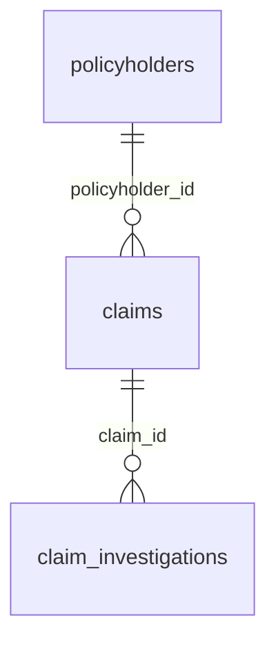
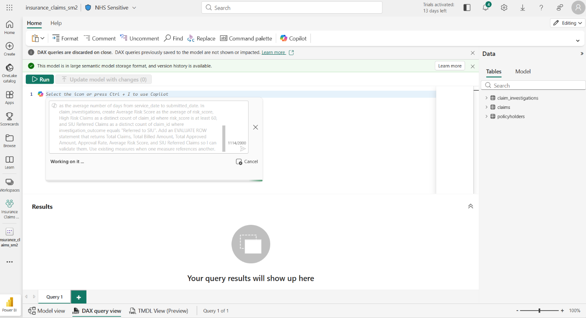
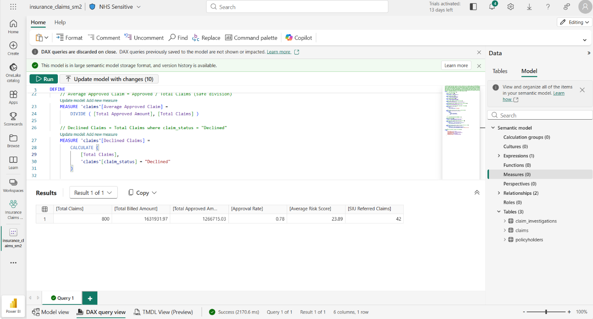
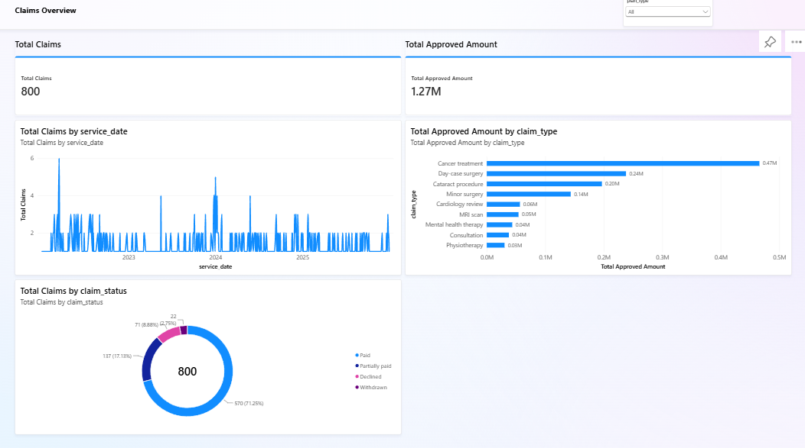
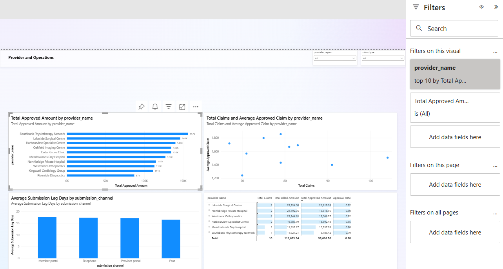
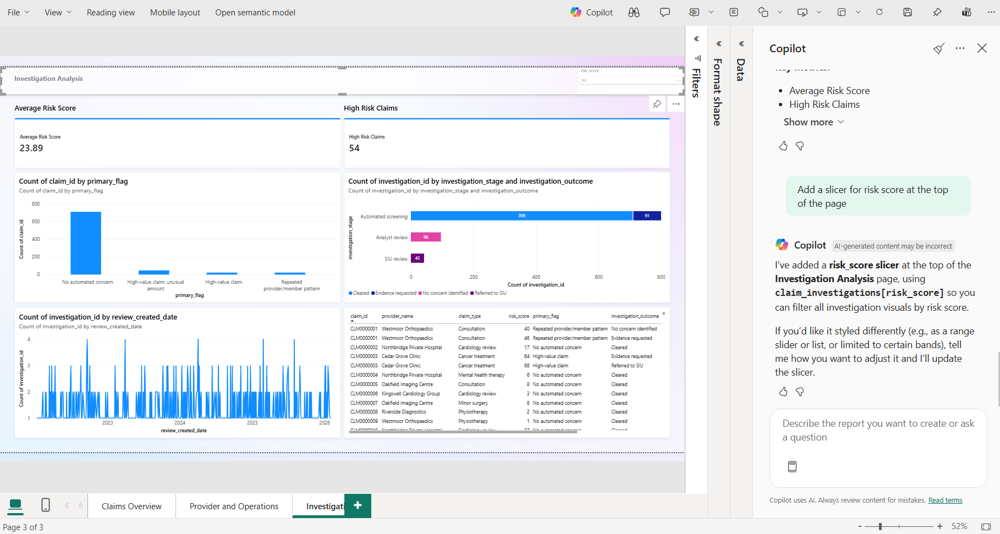
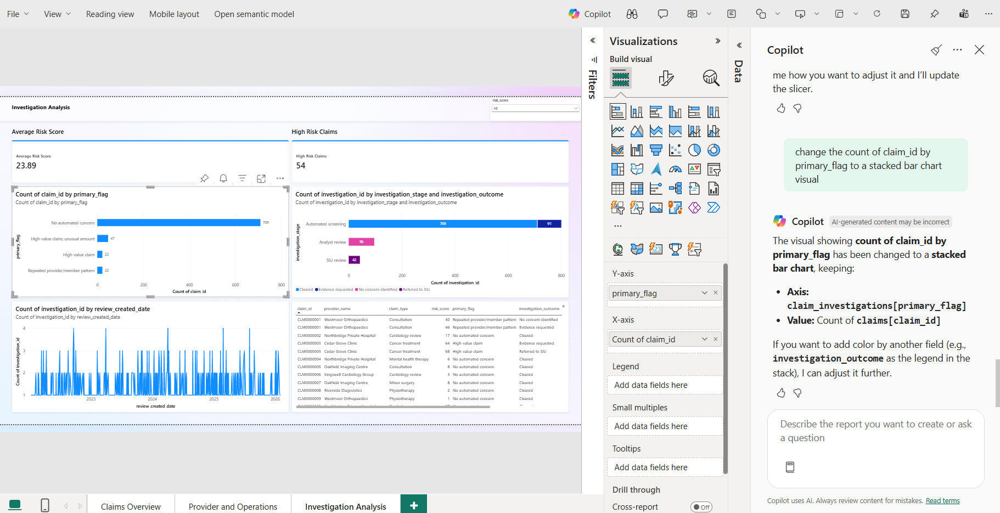

# Power BI Copilot Hackathon Instruction Manual

This guide takes you from three CSV files to a working Power BI semantic model, Copilot-generated report pages, and Copilot-assisted data exploration.

The hackathon is intentionally open-ended: you are welcome to use the data and Copilot in whatever way interests you. The steps, measures, report pages, and prompts below are examples to help you get started and show what is possible, not a fixed set of tasks that you must reproduce exactly. Adapt them, combine them, or replace them with your own ideas.

> All data is synthetic. Copilot output can be incomplete or incorrect, so verify every visual, measure, and narrative against the semantic model.

## Explore different personas

Try approaching the data from more than one perspective:

- **Report developer:** Prepare the semantic model, ask Copilot to generate or explain DAX, use Copilot to create and edit report pages, adjust formatting manually, and improve the model so Copilot can understand it more accurately.
- **Report consumer:** Explore an existing report using natural-language questions, request summaries and comparisons, ask for supporting evidence, challenge an answer, and follow interesting findings with more specific questions.

Switch between the personas during the session. For example, ask a question as a consumer, notice that the report cannot answer it clearly, then return to the developer role to add a measure or visual. Experiment with your wording, compare Copilot responses, and keep asking follow-up questions. The aim is to discover both what Copilot can do and where human judgement and model design are still important.

## One possible outcome

If you follow the examples from end to end, you will have:

- A Fabric lakehouse containing three tables
- A Power BI semantic model with two active relationships
- A set of reusable business measures
- Three report pages covering claims, providers, and investigations
- A collection of prompts that report consumers can use to understand the data

## 1. Prerequisites

Before starting, confirm that:

- You can sign in to Microsoft Fabric.
- You have a workspace assigned to a supported paid Fabric or Power BI Premium capacity.
- Copilot is enabled for your tenant and capacity by your administrator.
- You can create lakehouses, semantic models, and Power BI reports in the workspace.
- Your browser allows downloads from GitHub.

Copilot availability depends on your tenant, region, capacity, licensing, and administrator settings. If the Copilot button is missing, ask your event facilitator before continuing.

## 2. Create a Fabric lakehouse

Fabric labels can change slightly over time, but the workflow remains the same.

1. Open [Microsoft Fabric](https://app.fabric.microsoft.com/).
2. Open the workspace supplied by your event facilitator.
3. Select **New item**.
4. Search for and select **Lakehouse**.
5. Name it `HealthInsuranceClaims`.
6. Select **Create**.
7. Wait for the Lakehouse explorer to open.

## 3. Choose a data-ingestion option

You can use the supplied Fabric notebook to download and convert the data automatically, or download and load the files manually. Both options create the same three tables used throughout the rest of this guide.

### Option A: Use the automated notebook

Download [`Notebook CSV to Delta.ipynb`](../Notebook%20CSV%20to%20Delta.ipynb), or download the repository ZIP so that the notebook is available on your computer. Continue with **Option A** in section 4. You do not need to download the CSV files separately.

### Option B: Download and load the CSV files manually

The CSV files are located in the repository's [`data`](../data) folder:

- [`policyholders.csv`](../data/policyholders.csv)
- [`claims.csv`](../data/claims.csv)
- [`claim_investigations.csv`](../data/claim_investigations.csv)

#### Download the repository

1. On the repository page, select **Code**.
2. Select **Download ZIP**.
3. Extract the ZIP file.
4. Open the `data` folder and confirm that all three CSV files are present.

#### Download files individually

1. Open a CSV file from the list above.
2. Select **Download raw file**.
3. Repeat for all three files.

Keep the filenames unchanged. They will become the table names used throughout this guide. Continue with **Option B** in section 4.

## 4. Ingest the CSV data

Follow only the option you selected in section 3.

### Option A: Run the automated notebook

1. Return to the workspace containing `HealthInsuranceClaims`.
2. Import [`Notebook CSV to Delta.ipynb`](../Notebook%20CSV%20to%20Delta.ipynb) as a Fabric notebook.
3. In the notebook's Lakehouse explorer, add `HealthInsuranceClaims` and set it as the default lakehouse.
4. Restart the Spark session if Fabric prompts you to do so.
5. Select **Run all**.
6. Confirm that the notebook reports that it downloaded the demo files.
7. Refresh the Lakehouse explorer and confirm that all three CSV files appear under **Files** and all three tables appear under **Tables**.

The first code cell downloads files only when they are not already present in the default lakehouse. The second code cell reads each CSV with headers and inferred schemas, then writes a managed Delta table in overwrite mode. Rerunning the notebook therefore keeps the existing files but replaces the table contents.

If the notebook reports that no default lakehouse was found, confirm that `HealthInsuranceClaims` is attached and set as the default, restart the session, and run the notebook again.

After the three tables appear, skip Option B and continue with section 5.

### Option B: Upload and load the files manually

1. In the Lakehouse explorer, locate the **Files** section.
2. Select the ellipsis (`...`) beside **Files**, then select **Upload** > **Upload files**.
3. Select all three CSV files.
4. Start the upload.
5. Confirm that the following files appear under **Files**:
   - `policyholders.csv`
   - `claims.csv`
   - `claim_investigations.csv`

Uploading a file does not create a queryable table. Complete the next section for each file.

## 5. Load the files into tables

If you used the automated notebook, use this section only to verify the expected table names, row counts, and data types. The notebook has already created the tables.

If you chose manual ingestion, complete these steps for each CSV file:

1. Select the ellipsis (`...`) beside the file.
2. Select **Load to tables** > **New table**.
3. Use the filename without `.csv` as the table name.
4. Confirm that the first row is treated as the header.
5. Accept comma as the delimiter and review the preview.
6. Select **Load**.

Create exactly these tables:

| CSV file | Table name | Expected rows | Primary identifier |
|---|---|---:|---|
| `policyholders.csv` | `policyholders` | 300 | `policyholder_id` |
| `claims.csv` | `claims` | 800 | `claim_id` |
| `claim_investigations.csv` | `claim_investigations` | 938 | `investigation_id` |

### Check data types

Review the inferred types after loading. At minimum, use:

| Columns | Recommended type |
|---|---|
| All `_date` columns and `date_of_birth` | Date |
| `annual_premium_gbp`, `billed_amount_gbp`, `approved_amount_gbp` | Decimal number |
| `risk_score`, `review_sequence`, `provider_claims_last_90_days`, `member_claims_last_90_days` | Whole number |
| Identifier, category, name, code, Yes/No, and notes columns | Text |

Do not aggregate identifiers such as `claim_id`, `policyholder_id`, or `provider_id`.

## 6. Create the semantic model

1. From the lakehouse, start the **New semantic model** action. Depending on the current Fabric experience, this may appear on the lakehouse ribbon or under **New Power BI semantic model**.
2. Name the model `Health Insurance Claims`.
3. Select all three lakehouse tables.
4. Select **Confirm** or **Create**.
5. Open the semantic model in the web model editor.

### Establish the relationships

In model view, create or verify these relationships:

| From (one) | To (many) | Key | Cardinality | Cross-filter direction | Active |
|---|---|---|---|---|---|
| `policyholders` | `claims` | `policyholder_id` | One-to-many (`1:*`) | Single | Yes |
| `claims` | `claim_investigations` | `claim_id` | One-to-many (`1:*`) | Single | Yes |

The model should look like this:



If Fabric detects a many-to-many relationship, first check that the correct columns are selected. The one-side identifiers are unique in the supplied data.

### Improve Copilot's understanding

In the model editor:

1. Set identifier columns to **Do not summarize**.
2. Format GBP fields as currency with two decimal places.
3. Format date fields as dates rather than date/time.
4. Give measures clear business names.
5. If the model editor supports descriptions, add short descriptions to tables and measures.
6. Hide technical columns from report view only when they are not useful to participants.

Clear names, types, formats, and relationships give Copilot better model context.

## 7. Add useful measures

Use **Copilot in DAX Query view** to generate and test the measures for this exercise. The individual definitions later in this section are provided only as a reference and as a manual fallback if Copilot is unavailable or does not produce a correct measure.

### Create and test the measures with Copilot

Complete this step in Copilot within [DAX Query view](https://learn.microsoft.com/en-us/power-bi/transform-model/dax-query-view). Microsoft documents how to [write DAX queries with Copilot](https://learn.microsoft.com/en-us/dax/dax-copilot), including generating a query from natural language, running it before keeping it, revising it conversationally, and asking Copilot to explain it.



1. From the semantic model's menu in the workspace, select **Write DAX queries**.
2. Create a new query tab and open **Copilot**, or press **Ctrl+I**.
3. Paste the following prompt:

> Write a DAX query for this semantic model using `DEFINE MEASURE`. Define these measures in the stated tables: in `claims`, create `Total Claims` as a distinct count of `claim_id`, `Total Billed Amount` as the sum of `billed_amount_gbp`, `Total Approved Amount` as the sum of `approved_amount_gbp`, `Approval Rate` as approved amount divided safely by billed amount, `Average Approved Claim` as approved amount divided safely by total claims, `Declined Claims` as total claims filtered to `claim_status` equal to "Declined", and `Average Submission Lag Days` as the average number of days from `service_date` to `submitted_date`. In `claim_investigations`, create `Average Risk Score` as the average of `risk_score`, `High Risk Claims` as a distinct count of `claim_id` where `risk_score` is at least 60, and `SIU Referred Claims` as a distinct count of `claim_id` where `investigation_outcome` equals "Referred to SIU". Add an `EVALUATE ROW` statement that returns Total Claims, Total Billed Amount, Total Approved Amount, Approval Rate, Average Risk Score, and SIU Referred Claims so I can validate them. Use existing measures when one measure references another.

4. Select **Run** in the Copilot response and inspect the results. The unfiltered values should match the checkpoint below.
5. If the query fails or a value is wrong, ask Copilot to explain the relevant measure and correct the query. Review the proposed changes before accepting them.
6. Select **Keep query** when the query works. Confirm that the generated DAX now appears in the query editor and contains a `DEFINE` block with one `MEASURE` declaration for each measure.
7. Check the **Update model with changes** button. Its count should show the new or changed measures. Select it, review the listed changes, and confirm the update to add those measures to the semantic model.

   

8. In the model editor, apply the percentage, currency, whole-number, and decimal formats described below; Copilot's DAX query does not replace this formatting step.

> **Run does not update the model.** **Run** only tests the query, and **Keep query** only copies it into the query editor. The measures become permanent only after **Update model with changes** completes successfully.
>
> If **Update model with changes** still shows `(0)`, first confirm that you selected **Keep query** and that the editor contains `DEFINE MEASURE` declarations. A count of zero can also mean that identical measures already exist. If the declarations are present but the measures are missing from the model, confirm that you have write permission and that the workspace allows semantic-model editing.

Copilot checks generated query syntax and may retry once, but it can still produce incorrect DAX. Verify the table, column, aggregation, filter behavior, and checkpoint values before updating the model.

> A standalone definition such as `Total Claims = DISTINCTCOUNT(claims[claim_id])` is valid in the **New measure** formula bar, but not in DAX Query view. DAX Query view requires `DEFINE MEASURE` and an `EVALUATE` statement.

### Go further in the same DAX Query view

Complete these challenges in the same query tab after selecting **Keep query** in step 6 above. These are prompts for the inline **Copilot** panel; do not paste them into the DAX query editor or select **Run** on the prompt text.

1. Select the complete generated `DEFINE MEASURE` and `EVALUATE` query in the query editor.
2. Open Copilot with **Ctrl+I**. Copilot receives the selected query as context.
3. Choose one of these challenges:
   - Select **Explain this query**, or enter: `Explain the selected DAX query in plain English. For each measure, describe the calculation and identify any filter-context or division-by-zero issues.`
   - Enter: `Modify the selected query's EVALUATE statement to compare Total Claims, Total Approved Amount, and Average Approved Claim by claim_type. Keep all DEFINE MEASURE statements unchanged.`
4. Review Copilot's response. For a modified query, select **Run** in the Copilot response, check the results, and select **Keep query** only if the change is useful.

To explore a new measure, create a new query tab, open Copilot with **Ctrl+I**, and enter:

> Suggest three additional measures for monitoring claim cost, processing time, and investigation risk using only fields in this semantic model. Explain why each could be useful, then write a DAX query that defines and evaluates them without changing the model.

Run the generated query and check its results. Only select **Update model with changes** if you have validated a measure and want to add it permanently.

### Manual fallback and reference measures

Use the definitions below to check Copilot's output. If Copilot is unavailable or cannot generate a correct measure, add only the affected measure manually:

1. In your Fabric workspace, open the `Health Insurance Claims` **semantic model**.
2. Select **Open data model** or **Edit data model**.
3. In the **Data** pane, select the table that will contain the measure:
   - Use `claims` for the first seven measures, from `Total Claims` through `Average Submission Lag Days`.
   - Use `claim_investigations` for the final three measures, from `Average Risk Score` through `SIU Referred Claims`.
4. Select **New measure** from the ribbon. If it is not visible, right-click the target table and select **New measure**.
5. Paste one complete definition into the formula bar, then select the checkmark or press **Enter**.

> For manual creation, use the **New measure** formula bar, not the lakehouse, a notebook, SQL query editor, report Copilot prompt box, or DAX Query view.

```DAX
Total Claims =
DISTINCTCOUNT(claims[claim_id])
```

```DAX
Total Billed Amount =
SUM(claims[billed_amount_gbp])
```

```DAX
Total Approved Amount =
SUM(claims[approved_amount_gbp])
```

```DAX
Approval Rate =
DIVIDE([Total Approved Amount], [Total Billed Amount])
```

```DAX
Average Approved Claim =
DIVIDE([Total Approved Amount], [Total Claims])
```

```DAX
Declined Claims =
CALCULATE(
    [Total Claims],
    claims[claim_status] = "Declined"
)
```

```DAX
Average Submission Lag Days =
AVERAGEX(
    claims,
    DATEDIFF(claims[service_date], claims[submitted_date], DAY)
)
```

Create the following measures in the `claim_investigations` table:

```DAX
Average Risk Score =
AVERAGE(claim_investigations[risk_score])
```

```DAX
High Risk Claims =
CALCULATE(
    DISTINCTCOUNT(claim_investigations[claim_id]),
    claim_investigations[risk_score] >= 60
)
```

```DAX
SIU Referred Claims =
CALCULATE(
    DISTINCTCOUNT(claim_investigations[claim_id]),
    claim_investigations[investigation_outcome] = "Referred to SIU"
)
```

Format `Approval Rate` as a percentage, the amount measures as GBP currency, and the other measures as whole or decimal numbers as appropriate.

### Checkpoint

With no report filters applied, the supplied data should produce approximately:

| Check | Expected result |
|---|---:|
| Total Claims | 800 |
| Total Billed Amount | £1,631,931.97 |
| Total Approved Amount | £1,266,715.03 |
| Approval Rate | 77.62% |
| Average Risk Score | 23.89 |
| SIU Referred Claims | 42 |

Small display differences caused by rounding are acceptable. Larger differences usually indicate an incorrect aggregation, relationship, or data type.

## 8. Build report pages with Power BI Copilot

The three pages below demonstrate one possible report. You are encouraged to change the audience, business question, visuals, layout, and style, or create completely different pages. Try prompting for the same outcome in different ways and observe how the result changes.

From the semantic model, select **Create report** and open the Copilot pane. Add one page at a time. Copilot may choose different visual types between runs, so prompts should state the business goal, required measures, breakdowns, filters, and layout.

> **Copilot editing capabilities:** According to Microsoft's [Create and Edit Power BI Reports with Copilot](https://learn.microsoft.com/en-us/power-bi/create-reports/copilot-create-reports) guidance, Copilot can add, delete, and change visuals on an existing report page, including changing a visual's type or fields. You can also undo and redo recent Copilot actions.
>
> **Know the limitations:** Copilot does not support custom visuals or styling and formatting changes. Changing a complex visual can also cause some detail or formatting to be lost, so check every result and make presentation changes manually. Report creation and editing require the semantic model's Q&A feature switch to be enabled and are not supported for real-time streaming models, live connections to Analysis Services, or semantic models with implicit measures disabled.

### Page 1: Claims overview

Goal: Explain overall volume, cost, status, and historical movement.

Use this prompt:

> Create a report page titled "Claims Overview". Add KPI cards for Total Claims, Total Billed Amount, Total Approved Amount, Approval Rate, and Average Approved Claim. Add a monthly line chart of Total Claims by service_date, a clustered bar chart of Total Approved Amount by claim_type, and a donut chart of Total Claims by claim_status. Add slicers for service_date and region. Sort time chronologically.

Example result:



**Prompt challenge:** Ask Copilot to adapt the page for an executive audience by removing a lower-priority visual or changing a visual type or its fields. Compare the result with the original, use undo if needed, and make any layout or formatting changes manually.

Copilot-generated pages do not always include every requested visual or exactly match the example. If a slicer is missing, add it manually from the **Visualizations** pane.

### Page 2: Provider and operational analysis

Goal: Compare providers, submission channels, geographic alignment, and submission lag.

Use this prompt:

> Create a report page titled "Provider and Operations". Add a bar chart showing Total Approved Amount by provider_name, a scatter chart comparing Total Claims and Average Approved Claim by provider_name, a column chart of Average Submission Lag Days by submission_channel, and a matrix with provider_name, provider_region, Total Claims, Total Billed Amount, Total Approved Amount, and Approval Rate. Add slicers for provider_region and claim_type. Show the top 10 providers by Total Approved Amount where a visual needs a limit.

Example result:



This page is a good candidate for the Narrative visual exercise below because it contains several provider and operational comparisons.

### Page 3: Investigation and risk analysis

Goal: Explore review workload and simulated risk signals without making allegations.

Use this prompt:

> Create a report page titled "Investigation Analysis". Add KPI cards for Average Risk Score, High Risk Claims, and SIU Referred Claims. Add a column chart of distinct claims by primary_flag, a stacked bar chart of investigation records by investigation_stage and investigation_outcome, a line chart of investigation records by review_created_date, and a table containing claim_id, provider_name, claim_type, risk_score, primary_flag, investigation_outcome, duplicate_document_signal, and identity_mismatch_signal. Add slicers for primary_flag and investigation_outcome. Use the title "Simulated investigation indicators" above the detail table.

Example result:



**Prompt challenge:** In the report Copilot pane, ask:

> Change the count of claim_id by primary_flag to a stacked bar chart visual.

Copilot should change the existing visual while retaining its `primary_flag` axis and claim count value. Check those fields in the **Visualizations** pane because Copilot can select a similarly named field or aggregation.



Format `risk_score` manually if you want higher scores to be more visually prominent, because Copilot does not support styling or formatting changes.

Verify that selecting a policyholder, claim type, or provider filters investigation visuals through both relationships.

### Add a narrative visual with Copilot

**Narrative with Copilot is a Power BI visual type that you add to the report canvas.** It is not a prompt to enter in the report Copilot pane. Like a chart, card, or slicer, the narrative occupies space on the page; instead of plotting data, it generates a written summary of the report visuals you choose.

Add a [Narrative visual with Copilot](https://learn.microsoft.com/en-us/power-bi/create-reports/copilot-create-narrative) to one of the completed report pages:

1. Open the report in **Edit** mode and go to the page you want to summarize.
2. Click an empty area of the report canvas, then select the **Narrative** visual icon in the **Visualizations** pane. Power BI adds a new narrative visual container to the page.
3. Under **Choose a narrative type**, select **Copilot**.
4. Choose the report content to summarize. For a focused result, select the current page or include only its KPI cards and charts; exclude slicers and detailed tables unless they are important to the summary.
5. Use a custom prompt such as:

   > Summarize the most important patterns on this page for an operational audience. Highlight the largest change, the most important comparison, and one area worth investigating further. Include supporting values, use neutral language, and do not infer causation or wrongdoing.

6. Select **Create**, read the generated narrative, and use its footnotes to check which visuals support each statement.
7. To change the result, use **Adjust your summary with Copilot** and give more specific instructions about the focus, tone, or level of detail.
8. Change the page slicers and select **Refresh** on the narrative visual to regenerate the summary for the new filter context.

The narrative summarizes only the visuals selected during configuration, not the entire semantic model. Its body cannot be edited directly: use another prompt to change it. It also does not refresh automatically when data, filters, or slicers change, so always select **Refresh** before relying on the updated narrative.

### If Copilot cannot create a requested page

Simplify or reword the original prompt. You can also build the page incrementally:

1. Ask Copilot to create the page and KPI cards.
2. Ask it to add one visual at a time.
3. Ask it to change a visual type or adjust its fields.
4. Add slicers, layout changes, and formatting manually where needed.

If page creation remains unavailable, check the Q&A feature switch and confirm that the semantic model does not use one of the unsupported connection or model configurations listed above. Copilot is an assistant, not a replacement for model validation.

## 9. Consumer prompts: understand the report

Now switch from report developer to report consumer. Open Copilot from the finished report and try the prompts below, edit them to reflect your own interests, or ask entirely different questions. Treat the first response as the start of a conversation: ask follow-up questions, request clarification, and test whether the answer is supported by the report. Where supported, use references or citations in Copilot's answer to inspect the supporting visuals.

1. `Summarise the most important claims trends in this report in five bullet points.`
2. `How have claim volume and total approved amount changed over time? Call out any unusually high or low periods.`
3. `Which claim types account for the largest approved amounts, and is that because of claim volume or average claim size?`
4. `Compare billed and approved amounts by claim type. Where are the largest absolute and percentage differences?`
5. `Which regions and plan types have the highest claim volumes? Include the values and explain the active filters.`
6. `Which providers have the highest approved amounts? Also show their claim counts so I can distinguish volume from average cost.`
7. `How does submission lag vary by submission channel and claim type?`
8. `What patterns are associated with high investigation risk scores? Describe associations only; do not infer causation or wrongdoing.`
9. `How many distinct claims were referred to SIU, and which primary flags occur most often for those claims?`
10. `Explain what the current report filters are and how they affect the figures on this page.`

Useful follow-up prompts include:

- `Show the values and time period supporting that statement.`
- `Which visual or measure supports this answer?`
- `Rephrase this for a non-technical audience without losing the caveats.`
- `What can this dataset not tell us?`

### Go further

Do not stop at a summary. Ask Copilot to recommend where further investigation could be valuable, then challenge each recommendation by requesting evidence, comparisons, and caveats. Treat recommendations as starting points for analysis rather than conclusions.

Try two or three of these:

1. `Based on the current report, recommend three areas that deserve further investigation. Rank them by potential business impact, cite the values or trends behind each recommendation, and state what additional data or checks would be needed before taking action.`
2. `Look across providers, claim types, regions, and plan types for combinations with unusually high average claim values or large gaps between billed and approved amounts. Recommend where I should drill down first, compare each result with an appropriate baseline, and avoid implying wrongdoing.`
3. `Review submission lag, risk scores, investigation flags, and outcomes together. Suggest three operational questions or hypotheses worth testing next. For each one, give the supporting evidence, an alternative explanation, and a useful next analysis or data point. Do not infer causation from an association.`

Follow a recommendation into the detail:

- `Break that result down by month and claim type. Does the pattern persist or come from a small number of claims?`
- `What evidence in this report could contradict your recommendation?`
- `What additional measure, visual, or data field would help test this properly?`

## 10. Final validation checklist

Before presenting your report, confirm that:

- [ ] All three files exist under the lakehouse **Files** area.
- [ ] All three tables exist and have the expected row counts.
- [ ] Identifier, date, whole-number, and decimal columns have appropriate types.
- [ ] Both relationships are active, one-to-many, and single-direction.
- [ ] Identifier fields use **Do not summarize**.
- [ ] Amount and percentage measures have appropriate formats.
- [ ] The unfiltered measures match the checkpoint values.
- [ ] Slicers from `policyholders` filter claims and investigation visuals.
- [ ] Copilot-created visuals use measures rather than inappropriate implicit sums.
- [ ] Copilot narratives agree with the values shown in the report.
- [ ] Investigation wording remains neutral and clearly identifies the data as synthetic.

## 11. Troubleshooting

### Copilot is not visible

Confirm the workspace capacity, tenant setting, region, license, and permissions with your event facilitator or Fabric administrator.

### A file loaded as one column

Reload it using comma as the delimiter and enable first-row headers.

### Numbers or dates are treated as text

Correct the source table or semantic-model data type, refresh the model, and recheck the measures.

### A relationship appears many-to-many

Check that:

- `policyholders[policyholder_id]` is on the one side of the first relationship.
- `claims[claim_id]` is on the one side of the second relationship.
- You did not select similarly named foreign-key columns on both sides.
- Header rows were not imported as data.

### Totals are unexpectedly high

Do not sum claim amounts from the investigation table. A claim can have more than one investigation event. Use measures from `claims`, and use `DISTINCTCOUNT` when counting claims from `claim_investigations`.

### The syntax for 'Claims' is incorrect

You have probably pasted `Total Claims = ...` directly into **DAX Query view**. Either return to the semantic model editor and create it through `claims` > **New measure**, or wrap it in a complete `DEFINE MEASURE` and `EVALUATE` query as shown above. If you use DAX Query view, select **Update model with changes** after testing to add the measure permanently to the semantic model.

### Copilot uses the wrong field

Use exact table, column, and measure names in the prompt. Split complex requests into smaller steps and correct the visual manually when needed.

## Responsible-use reminder

This exercise demonstrates analytical workflows, not fraud detection or clinical decision-making. A risk score or investigation flag is a simulated indicator, not proof of fraud. Do not use sensitive attributes to profile people, and do not generalise findings from this synthetic dataset to real populations.
